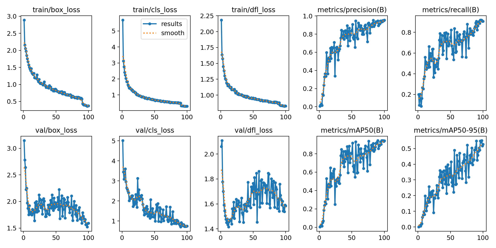
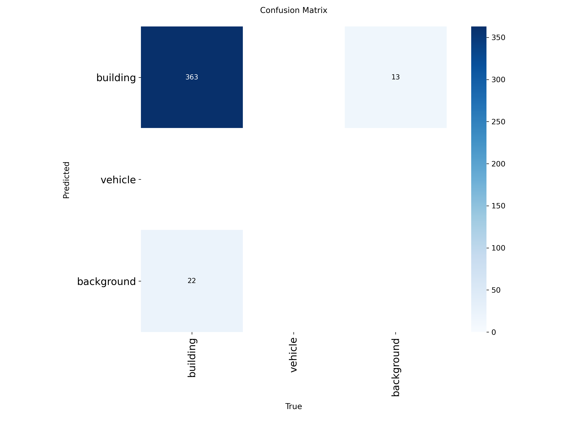
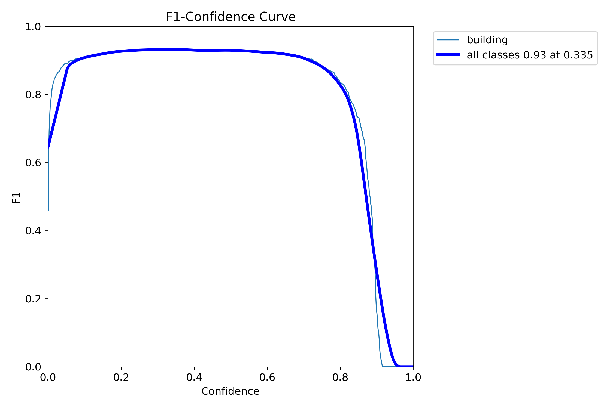
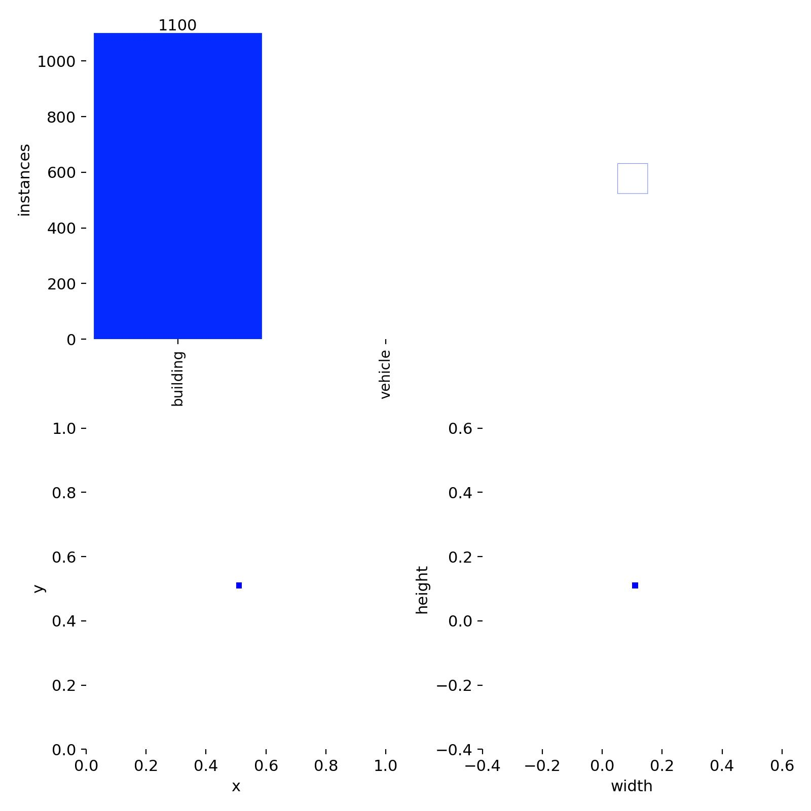
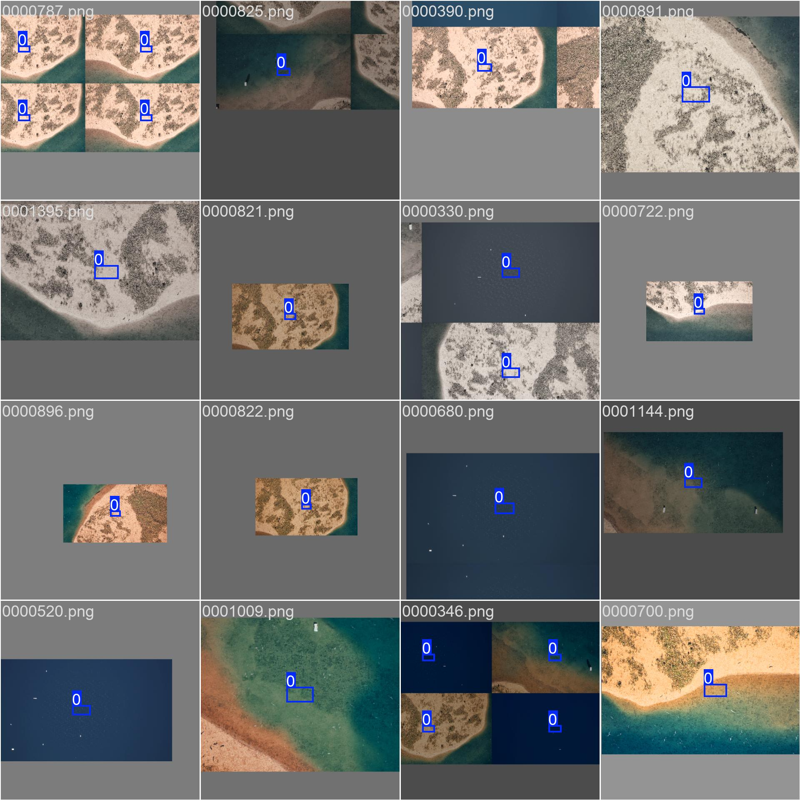
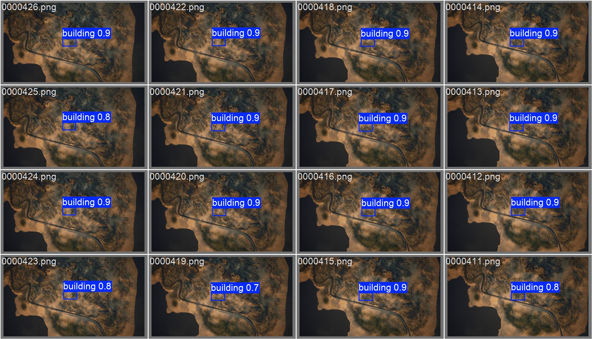

# Geospatial Object Detection for Infrastructure Mapping

This repository documents **Phase 1** of a geospatial computer vision project focused on detecting infrastructure from high-resolution satellite imagery. The primary objective of this phase was to establish a high-performance training pipeline using the **YOLOv8** architecture and verify hardware acceleration capabilities on local infrastructure.

## Project Overview
The project utilizes the **Duality AI / Lunate AI Geospatial Object Detection** dataset. Phase 1 focused on environment configuration, dataset structural integrity, and pipeline verification. Due to initial dataset access constraints, synthetic labels were generated to validate the end-to-end training process.

## Hardware and Environment
Training was conducted on local hardware to benchmark performance for future large-scale iterations.

* **GPU:** NVIDIA GeForce RTX 4060 (8GB VRAM)
* **Architecture:** YOLOv8 (Ultralytics)
* **Compute Platform:** CUDA 11.8
* **Training Time:** 0.482 hours for 100 epochs

## Training Performance and Results
The model was trained for 100 epochs. Training curves demonstrate stable convergence with a significant reduction in box and classification loss.

*Figure 1: Training and Validation Metrics over 100 epochs.*

### Key Metrics
| Metric | Value |
| :--- | :--- |
| **mAP50** | 0.951 |
| **Final Box Loss** | 0.3705 |
| **Precision (P)** | 1.00 (at 0.952 confidence) |
| **F1-Score** | 0.93 (at 0.335 confidence) |

### Detailed Evaluation
The model maintains high precision across various confidence thresholds, ensuring minimal false positives. The confusion matrix confirms high accuracy for the "building" class.

*Figure 2: Confusion matrix highlighting 363 true-positive detections.*

*Figure 3: F1 curve showing optimal balance at 0.335 confidence.*

## Dataset Visualization
The following images illustrate the model's ability to localize features based on the provided labels across 1100 instances.

### Ground Truth vs. Predictions
The model successfully identified the target regions in the center of the satellite tiles.

### Ground Truth vs. Predictions
The model successfully identified the target regions in the center of the satellite tiles, as defined by the Phase 1 labeling script.

*Figure 4: Dataset label distribution and spatial anchoring.*

*Figure 5: Dataset instance count (1100 buildings) and spatial anchoring.*

### Validation Batch Results
Validation batches show high confidence scores (ranging from **0.7 to 0.9**).

*Figure 6: Model predictions on validation tiles.*

## Repository Structure

    ├── weights/
    │   ├── best.pt
    │   └── last.pt
    ├── scripts/
    │   ├── train.py
    │   ├── make_labels.py
    │   
    ├── config/
    │   └── yolo_params.yaml
    └── visuals/
       ├── results.jpg
       ├── labels.jpg
       ├── confusion_matrix.png
       ├── BoxP_curve.png
       ├── BoxF1_curve.png
       └── val_batch0_pred.jpg

-----

## While Phase 1 successfully verified the pipeline and hardware performance, the following improvements are for Phase 2:

Integration of the full 10GB geospatial dataset.

Implementation of DINOv2 (Meta) backbone for enhanced feature extraction in complex terrain.

Refinement of the prediction string generator to improve Intersection over Union (IoU) scores on the competition leaderboard.

## How to Reproduce
* **Clone the repository.*

* **Install dependencies:**

      pip install -r requirements.txt

* **Execute training:**

      python scripts/train.py
